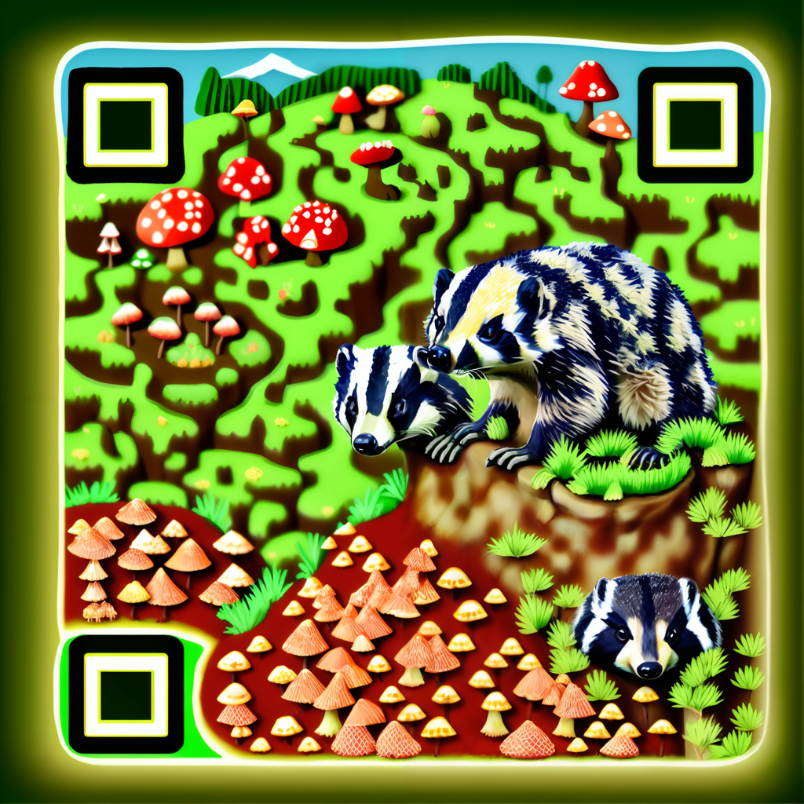

# comfy-qr

A set of ComfyUI nodes to dynamically create QR image layers for generative QR art without the hassle of leaving the webui.

This repository is managed publicly on [Gitlab](https://gitlab.com/sofuego-comfy-nodes/comfy-qr), but also mirrored on [Github](https://github.com/coreyryanhanson/comfy-qr). Please submit any [issues](https://gitlab.com/sofuego-comfy-nodes/comfy-qr/-/issues) or [pull requests](https://gitlab.com/sofuego-comfy-nodes/comfy-qr/-/merge_requests) to the gitlab repo.

## Getting started

This project currently contains two nodes for generating QR codes.

### QR Code

A dynamically sized QR code without any resampling scaled by the text length, the module size, and the error correction level.

#### Inputs

* `protocol` - If enabled this will prefix the textbox input with a preset to represent the internet protocol. This is included both for convenience and as a workaround for the textbox clipping strings with this character combination.
  * `Http` - Adds "http://" before the text.
  * `Https` - Adds "https://" before the text.
  * `None` - Uses only the contents of the `text` box.
* `text` - What text to build your QR code with. If `protocol` is specified, this textbox will be combined it with the selected option.
* `module_size` - The pixel width of the smallest unit of a QR code.
* `max_image_size` - The maximum size of the resulting QR code. If the combination of `text`, `module_size`, and `error_correction` create dimensions that exceed this, an error will halt the pipeline.
* `fill_hexcolor` - A string of characters representing the hex value of the QR units. Can be 3 or 6 hexadecimal characters with an optional # before.
* `back_hexcolor` - A string of characters representing the hex value of the space around the QR units. Can be 3 or 6 hexadecimal characters with an optional # before.
* `error_correction` - The level of error correction to apply.
  * `Low` - 7% error correction.
  * `Medium` - 15% error correction.
  * `Quartile` - 25% error correction.
  * `High` - 30% error correction.
* `border` - The border size (In multiples of `module` widths)

#### Outputs

* `IMAGE` - The QR code
* `QR_VERSION` - An integer of the QR version that was selected based on the text length and error correction level.
* `IMAGE_SIZE` - An integer based on the pixel width of the resulting QR code.

### QR Code (Conformed to Image Size)

A QR code fixed to specific output dimensions through image resampling.

#### Inputs

* `protocol` - If enabled this will prefix the textbox input with a preset to represent the internet protocol. This is included both for convenience and as a workaround for the textbox clipping strings with this character combination.
  * `Http` - Adds "http://" before the text.
  * `Https` - Adds "https://" before the text.
  * `None` - Uses only the contents of the `text` box.
* `text` - What text to build your QR code with. If `protocol` is specified, this textbox will be combined it with the selected option.
* `image_size` - The pixel dimensions to conform the QR code to.
* `fill_hexcolor` - A string of characters representing the hex value of the QR units. Can be 3 or 6 hexadecimal characters with an optional # before.
* `back_hexcolor` - A string of characters representing the hex value of the space around the QR units. Can be 3 or 6 hexadecimal characters with an optional # before.
* `error_correction` - The level of error correction to apply.
  * `Low` - 7% error correction.
  * `Medium` - 15% error correction.
  * `Quartile` - 25% error correction.
  * `High` - 30% error correction.
* `border` - The border size (In multiples of `module` widths)
* `resampling` - The resampling algorithm to use when rescaling the QR code.
  * `Bicubic` - Bicubic interpolation
  * `Bilinear` - Bilinear interpolation
  * `Box` - Box interpolation
  * `Hamming` - Hamming interpolation
  * `Lanczos` - Lanczos interpolation
  * `Nearest` - Nearest Neighbor interpolation

#### Outputs

* `IMAGE` - The QR code
* `QR_VERSION` - An integer of the QR version that was selected based on the text length and error correction level.

## Future updates

If the solution is clean enough, I plan on implementing a node that will automatically generate a mask to extract the 3 QR markers (based on `module_size`, `border`, and `QR_VERSION`) for more advanced workflows.